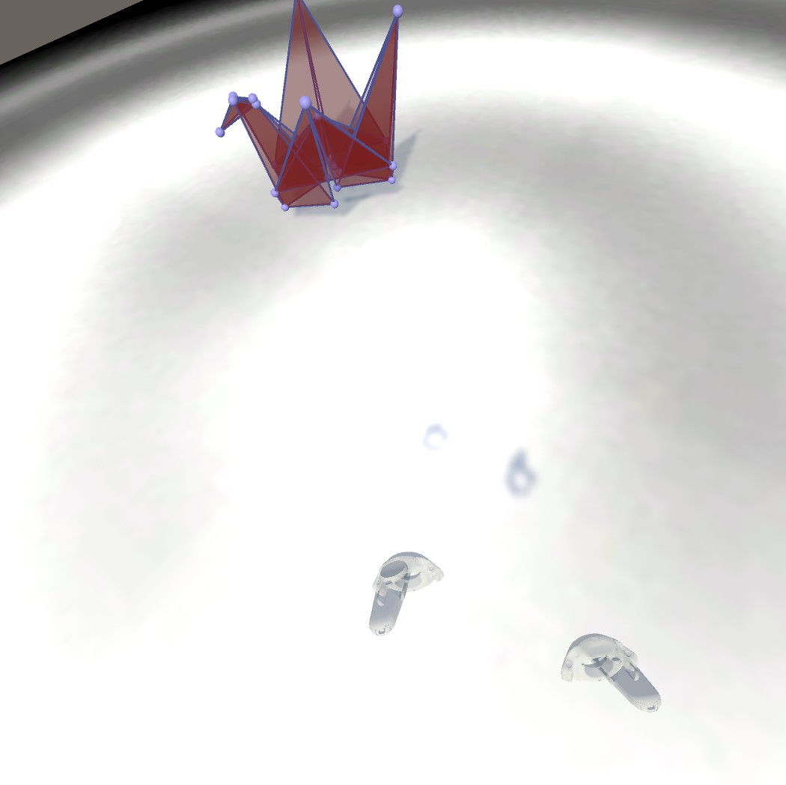
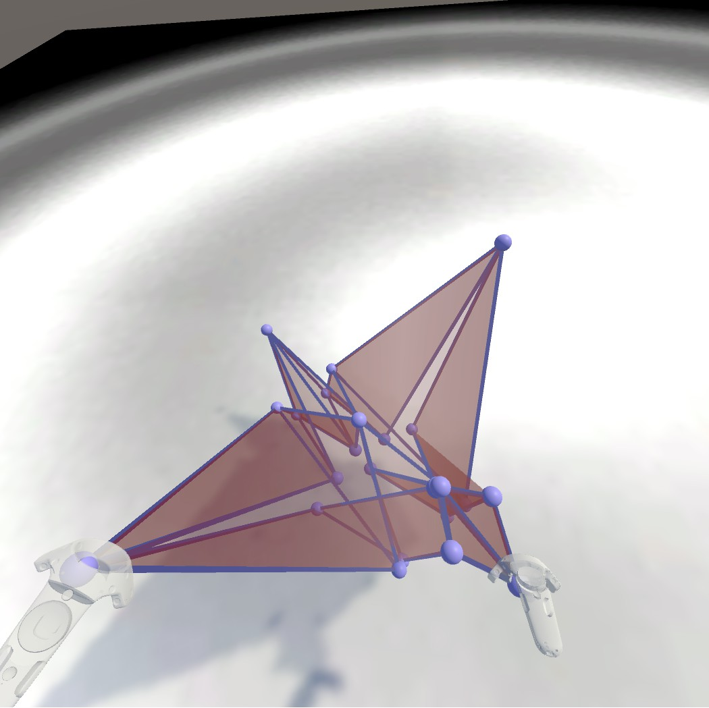

# Folding

This project allows users to manipulate points on a plane to form whatever 3D shape they want.  A JSON file format is used to save the vertices’ xyz positions, and which vertices are connected together as triangles.  This involves extensive manipulation of Unity’s mesh component.

Dependent on the <a href ="https://github.com/edemaine/fold">fold spec</a>, working on replicating some of the API functionality in C# (original is coffeescript)

Example mesh generated by <a href="https://github.com/freestraws/Folding/blob/master/Assets/StreamingAssets/flappingBird.fold">a JSON file</a>:

To do:
* Constrain user movement of points using a hinge joint system with the connected anchor for each point being the edge perpendicular to the selected point (choose this perpendicular edge and create the hinge joint upon point selection).  Use the NVRInteractableRotator script as a basis.