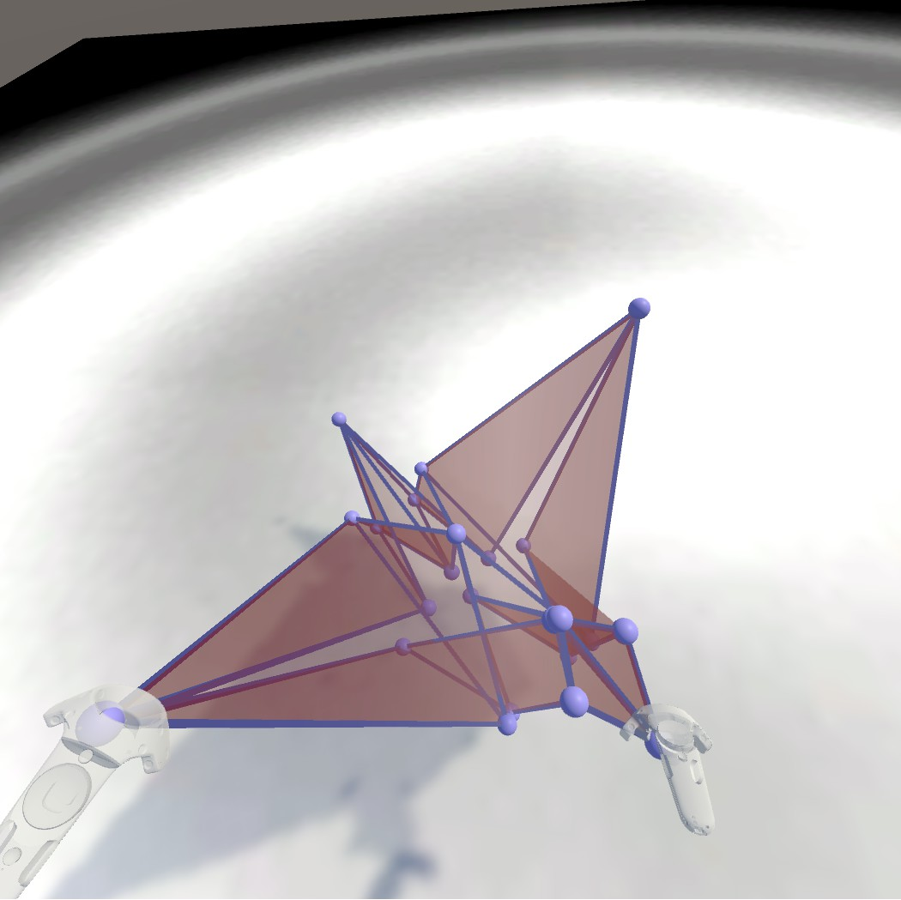

# Folding

This project allows users to manipulate points on a plane to form whatever 3D shape they want.  A JSON file format is used to save the vertices’ xyz positions, and which vertices are connected together as triangles.  This involves extensive manipulation of Unity’s mesh component.

Dependent on the <a href ="https://github.com/edemaine/fold">fold spec</a>, working on replicating some of the API functionality in C# (original is coffeescript)

Example mesh generated by <a href="https://github.com/freestraws/Folding/blob/master/Assets/StreamingAssets/flappingBird.fold">this JSON file</a>:
